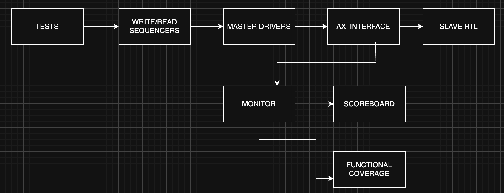
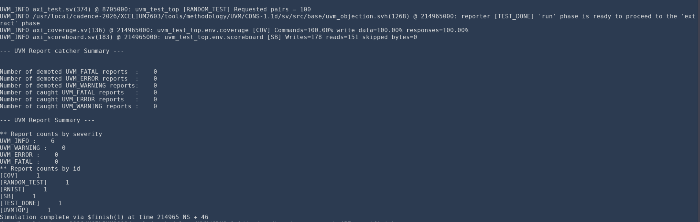
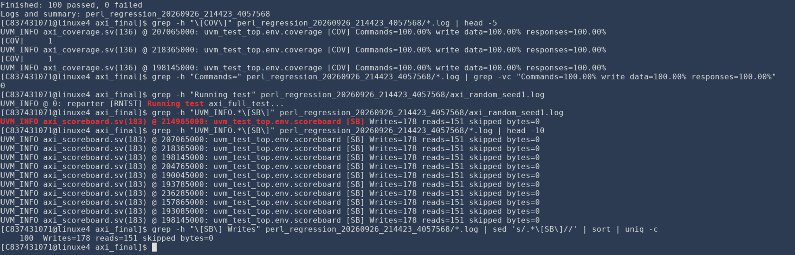

# AXI4 Memory Slave with UVM Verification

I designed a 16 KB AXI4 memory-mapped slave and built a UVM testbench to check its transactions. The project covers five AXI channels, INCR bursts, byte strobes, narrow and unaligned accesses, boundary cases, error responses, and constrained-random traffic. I used Cadence Xcelium and SimVision for the verification runs. A separate, smaller memory variant was used for an exploratory Cadence Genus synthesis run.

**Regression result:** The supplied 100-seed full-test run recorded 100 passes. Each pass required 100% of the current command, write-data, and response coverage groups, zero UVM errors or fatals, and zero skipped bytes. These are results for the defined checks, not a claim of complete AXI4 verification.

## What the design supports

| Feature | Implementation |
| --- | --- |
| Memory | 16 KB, organized as 4096 × 32-bit words |
| Byte address range | `0x0000`–`0x3FFF` |
| Default widths | 32-bit address, 32-bit data, 4-bit transaction ID |
| Channels | AW, W, B, AR, R |
| Bursts | INCR, 1–256 beats (`AxLEN + 1`) |
| Transfer sizes | 1, 2, or 4 bytes per beat |
| Write masking | `WSTRB` selects the bytes written |
| Read and write control | Separate controllers, one outstanding burst per direction |
| Responses | `OKAY` for supported in-range accesses; `SLVERR` for unsupported commands or out-of-range beats |

The slave echoes `AWID` on `BID` and `ARID` on `RID`. It accepts unaligned starting addresses and uses the appropriate byte lanes on the first beat. The master-side random constraints keep bursts within a 4 KB page; that AXI rule is not treated as a slave error. Memory starts at zero in simulation. The RTL's initialization loop is excluded from synthesis.

## Design and testbench

The RTL is in [`rtl/design.sv`](rtl/design.sv). A write controller accepts AW, consumes exactly `AWLEN + 1` W beats, applies legal `WSTRB` lanes, and returns B. A separate read controller accepts AR and produces R beats with `RRESP` and `RLAST`. The two controllers can operate independently.

The UVM package is in [`tb/axi_pkg.sv`](tb/axi_pkg.sv), with the included components in `tb/`. The master agent contains separate write and read sequencers and drivers. Its monitor observes channel handshakes and sends write and read events to a scoreboard and coverage collector. The scoreboard maintains a byte-addressed reference memory and checks IDs, data, responses, and final-beat behavior. It also handles reads and writes observed on the same clock edge.



The monitor observes the AXI interface, including request and response handshakes, then sends those observations to the scoreboard and functional coverage. The top row shows the stimulus path; AXI responses return through the same interface to the master drivers.

## Tests

| Test | Main check |
| --- | --- |
| `axi_smoke_test` | Single 32-bit write and readback at `0x100` |
| `axi_burst_test` | Four-beat INCR write and readback at `0x200` |
| `axi_narrow_test` | Byte and halfword accesses, unaligned starts, all 16 strobe patterns, and full-word readback |
| `axi_boundary_test` | First and last memory addresses, 4 KB page edges, and a 256-beat burst |
| `axi_error_test` | Unsupported burst types, oversized transfers, out-of-range address, memory preservation, and recovery |
| `axi_random_test` | Legal randomized addresses, lengths, sizes, IDs, data, and strobes |
| `axi_full_test` | Directed scenarios followed by random traffic |

The random test initializes all 16 KB before partial writes so every read byte can be checked. It runs 100 write/read pairs by default. `+N_TXNS=500` increases that count without editing the source. The multi-seed regression uses different simulator seeds to vary the generated transactions.

## Results



The `axi_full_test` run reported **100% command, write-data, and response functional coverage**, with **178 writes, 151 reads, zero skipped bytes, and zero UVM warnings, errors, or fatals**. This means every bin in the current functional coverage model was hit. It does not mean every possible AXI4 behavior was verified.

The [random-only run](docs/images/axi_random_seed1.png) reported 116 writes (16 initialization bursts plus 100 random writes), 100 reads, zero skipped bytes, and zero UVM errors.

The supplied [100-seed result table](results/regression_100_seeds.csv) contains seeds 1–100, each marked PASS. This was a seeded `axi_full_test` run: every seed ran the directed scenarios and then 100 constrained-random write/read pairs. The [original flat-layout Perl runner](scripts/as_run/run_axi_regression.pl) defined PASS as successful simulator completion, zero UVM errors and fatals, zero skipped bytes, and 100% in each of the three reported coverage groups. The source archive did not include the individual simulator logs; the CSV records PASS/FAIL only. The revised runner below records per-seed counts and coverage values for future runs.



Representative waveforms:

| Scenario | Evidence |
| --- | --- |
| Single-beat readback | [Smoke waveform](docs/images/axi_smoke_test_waveform.png) |
| Four-beat INCR burst | [Burst waveform](docs/images/axi_burst_test_waveform.png) |
| Byte strobes preserving untouched bytes | [Narrow-access waveform](docs/images/axi_narrow_test_waveform.png) |
| Unsupported FIXED burst returning `SLVERR` | [Error waveform](docs/images/axi_error_test_waveform.png) |
| UVM component hierarchy | [Topology](docs/images/axi_uvm_topology.png) |

## Run with Xcelium

From the repository root, with Cadence Xcelium and UVM available:

```bash
xrun -64bit -sv -uvm -incdir tb rtl/design.sv tb/testbench.sv -top tb_top -access +rwc -coverage all +UVM_TESTNAME=axi_full_test +N_TXNS=100 -svseed 1 -covtest axi_full_seed1 -l axi_full_seed1.log
```

To run one directed test, replace `axi_full_test` with its class name in the table above. The top-level testbench calls `run_test()` so `+UVM_TESTNAME` selects the class.

For a full regression with 100 seeds and 100 random pairs per seed:

```bash
perl scripts/run_full_regression.pl 100 100 --quiet
```

Quiet mode prints one PASS/FAIL line per seed. Detailed Xcelium logs and a richer CSV go into a timestamped directory under `results/`. This restructured script uses the same full-test selection and coverage checks as the supplied run, but has not yet been run on Xcelium.

For a random-only regression without per-seed coverage databases:

```bash
perl scripts/run_random_regression.pl 100 100 --no-coverage --quiet
```

The random-only script runs `axi_random_test`, while the documented 100-seed CSV came from `axi_full_test`. Generated simulator files and coverage databases are ignored by Git.

## Synthesis status

The full RTL models 16 KB of memory. Synthesis with standard cells was explored using a **256-byte, 64 × 32-bit memory variant** because implementing all 16 KB as flip-flops would dominate this exercise. The scaled variant is in [synthesis/design_synth.sv](synthesis/design_synth.sv); its address-range check now matches its 256-byte memory.

The September 27 Genus run of the corrected 256-byte variant reported **+2.2216 ns worst setup slack** against a 10 ns clock, **zero violating setup paths**, and **74,943.126 µm² mapped cell area**. It reported 5,031 leaf cells, including 2,185 sequential cells. See the supplied [QoR screenshot](docs/synthesis_256b_qor.png) and [critical-path screenshot](docs/synthesis_256b_timing.png). These are synthesis estimates for the scaled variant, before placement and routing. The new text reports and netlist have not yet been archived here.

The [prior Genus run](synthesis/as_run/reports/qor.rpt) used an earlier 64-word copy whose address-range check still allowed 16 KB. That mismatch permits out-of-array memory accesses above 255 bytes, so its +1.64 ns setup slack and 74,949 µm² cell area are **superseded results for that earlier copy**, not results for the corrected variant or the full 16 KB design. The [as-run source and script](synthesis/as_run/) are retained alongside the reports for traceability.

The supplied [QoR screenshot](docs/synthesis_qor.png) and [timing screenshot](docs/synthesis_timing.png) also belong to that archived run.

From the repository root, after placing the SKY130 HD liberty file at `$HOME/sky130_lib/sky130_fd_sc_hd__tt_025C_1v80.lib`, reproduce the corrected run with:

```bash
genus -files synthesis/synth.tcl -log synthesis/genus.log
```

The archived reports are also pre-layout estimates, and the archived power report is vectorless.

## Current scope

Startup reset is used in the testbench. Protocol assertions, randomized READY stalls, simultaneous read/write stress, mid-transaction reset, and checker mutation tests are planned extensions. This repository documents the working RTL and UVM milestone; it does not claim those extensions have been completed.

## License

The project is released under the [MIT License](LICENSE).
